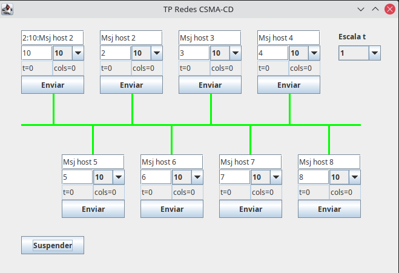

# Carrier Sense Multiple Access with Collision Detection
Trabajo práctico realizado para la cátedra "Redes de Información" UTN-FRM. Consiste en un sistema simulador de colisiones en una red y cómo son tratadas mediante el protocolo CSMA/CD. El proyecto fue realizado en Java en base a códgigo fuente brindado por bibliografía con algunas modificaciones.

## Tecnologías
El programa fue realizado en el lenguaje de programación Java. Para la interfaz gráfica se utilizó Java Swing y la gestión de dependencias se realizó con Maven. El proyecto fue realizado con IntelliJ Idea Community.
## Para Ejecutar la aplicación:
Para ejecutar la aplicación primero se deben descargar todas las dependencias con el uso de Maven. Esto se lográ con IntelliJ, haciendo click derecho sobre el archivo pom.xml, en el menú contextual de Maven se seleciona "Reload Project". Una vez que se han descargado todas las dependencias se puede proceder a ejecutar el proyecto desde la clase src/main/java/CSMA_CD.java. Se abrirá la pantalla de la aplicación.

  

## Para usar la aplicación:
Se puede probar la aplicación enviando mensajes entre los 8 host virtuales que se presentan en la red. Para ello se puede suspender la aplicación con el botón suspender, colocar en cada host el mensaje a enviar y el host destinatario y presionar el botón enviar. Una vez que se hayan cargado todos los mensajes a enviar y al presionar continuar, se observará la simulación. Cuando el canal se muestre verde, implica que el mismo se encuentra listo para transmitir, en cambio cuando se pinte de rojo es porque se produjo una colisión. Al detectar una colisión, los hosts dejarán de enviar y esperarán un tiempo aleatorio para volver en enviar su mensaje. En caso de producirse colisiones reiteradas, el tiempo de espera será cada vez mayor. Y en caso de producirse 16 colisiones el programa abortará el envio.
## Integrantes del grupo:
- Kevin Rodriguez
- Juan Troncoso
- Ignacio Arnold
- Virginia Lopez
- Facundo Erbin
- Nicolas Cavaller
